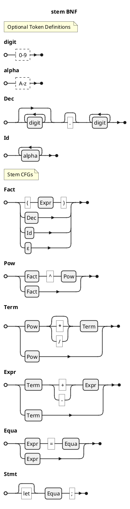
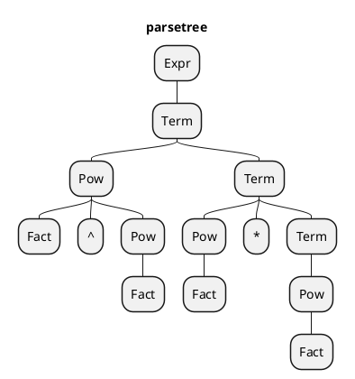

# Stem Context Free Grammars

## Proof of CFGs
- 4+a*b^(c+d)
### Bottomup Rightmost derivation (in reverse)
1. Dec+Id*Id^(Id+Id)
2. Fact+Id*Id^(Id+Id)
3. Pow+Id*Id^(Id+Id)
4. Term+Id*Id^(Id+Id)
5. Term+Fact*Id^(Id+Id)
6. Term+Pow*Id^(Id+Id)
7. Term+Pow*Fact^(Id+Id)
8. Term+Pow*Fact^(Fact+Id)
9. Term+Pow*Fact^(Pow+Id)
10. Term+Pow*Fact^(Term+Id)
11. Term+Pow*Fact^(Term+Fact)
12. Term+Pow*Fact^(Term+Pow)
13. Term+Pow*Fact^(Term+Term)
14. Term+Pow*Fact^(Term+Expr)
15. Term+Pow*Fact^(Expr)
16. Term+Pow*Fact^Fact
17. Term+Pow*Fact^Pow
18. Term+Pow*Pow
19. Term+Pow*Term
20. Term+Term
21. Term+Expr
22. Expr

## Proof of CFGs
- a^3b*4
### Topdown Leftmost derivation
- The CFGs rules are examined from greatest to least.
- Upon reaching the rule to examine. The input is compared to the keys of the rule; they are compared linearly (or as long as the default isn't the first) (The default is the value that is always resolved).
- The input is always revised from left to right for any matching keys. The literals in the rule definition are the "keys" that are looked for.
  - The first one found is evaluated.
- At level 2-3, the current input 'a' is checked against a '*', '/', or any operator symbol, but instead '^' is found. The '^' is absorbed to the left handside of the derivation. Because the '^' was observed, then so is the next input absorbed to the left handside: '3'. The current input is then '3' and is checked against a 'Fact'.  
1. Expr
2. Term
3. PowTerm
4. Fact^PowTerm
5. Fact^FactTerm
6. Fact^FactPow*Term
7. Fact^FactFact*Term
8. Fact^FactFact*Pow
9. Fact^FactFact*Fact

### Topdown Rightmost derivation
1. Expr
2. Term
3. PowTerm
4. PowPow*Term
5. PowPow*Pow
6. PowPow*Fact
7. PowFact*Fact
8. Fact^PowFact*Fact
9. Fact^FactFact*Fact

### Bottomup Leftmost derivation
1. Fact^FactFact*Fact
2. Fact^PowFact*Fact
3. PowFact*Fact
4. PowPow*Fact
5. PowPow*Pow
6. PowPow*Term
7. PowTerm
8. Term
9. Expr

### Bottomup Rightmost derivation
- CFG rules are examined from least to greatest.
- The rule to examine will instead be in the key. Upon Finding the rule where they key lies, it is compared to all the keys in that rule (leaving the default for last).
- The input is examined from right to left.
- If the input partially matches some portion of the key, then the next input is examined and evaluated. It becomes the current input until it undergoes a change. When it does, the current input becomes the rightmost again.
1. Fact^FactFact*Fact
2. Fact^FactFact*Pow
3. Fact^FactFact*Term
4. Fact^FactPow*Term
5. Fact^FactTerm
6. Fact^PowTerm
7. PowTerm 
8. Term
9. Expr

