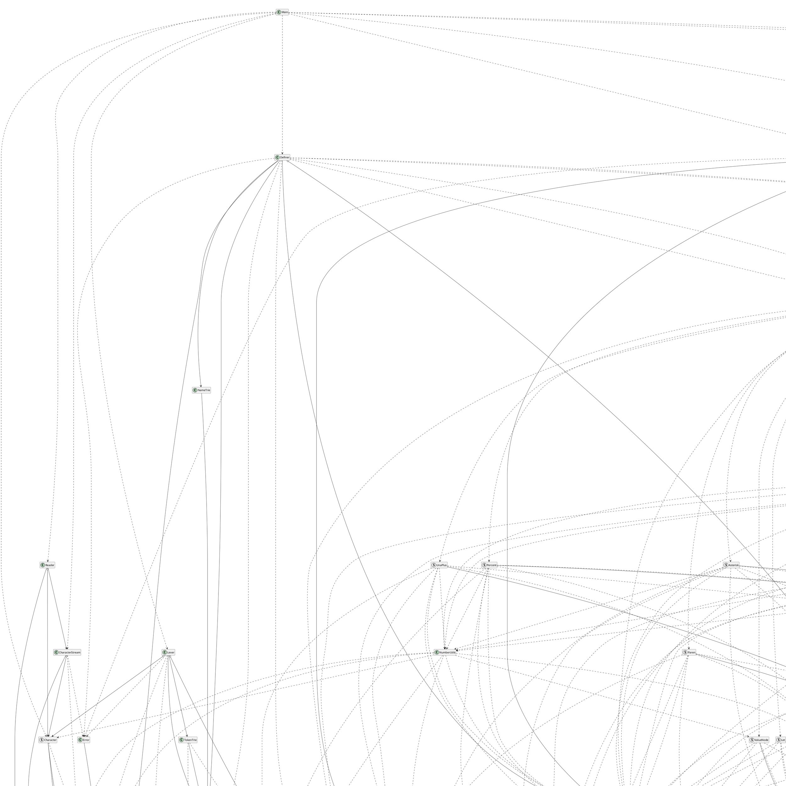

# Mua Class Diagram



```plantuml
class Asterisk
class FSlash
class NodeFactory
interface INodeFactory
class Parser

NodeFactory ..> Asterisk
NodeFactory ..> FSlash
Asterisk ..> INodeFactory
FSlash ..> INodeFactory
Parser ..> NodeFactory
Parser ..> INodeFactory
```
