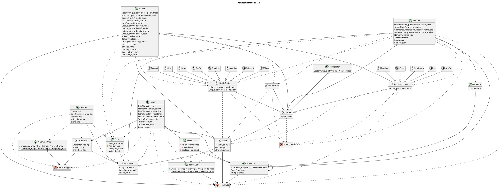

# Stem Class Diagram

```plantuml
@startuml stem class diagram
'https://plantuml.com/class-diagram
title newstem class diagram

hide methods

struct Position {
string file_name
int column_nums[2]
int line_num
void init()
}
enum CharacterType
class CharacterUtils {
+{static} unordered_map<char, CharacterType> cC_map
+{static} unordered_map<ChatacterType, string> repr_map
}
CharacterUtils o--> CharacterType
struct Character {
CharacterType type
Position pos
char character
}
Character --> CharacterType
Character --> Position
class Reader {
fstream file
list<Character> char_list
Position pos
string file_name
string line
}
Reader o--> Character
Reader --> Position
Reader ..> CharacterUtils
Reader ..> Error
Reader ..> CharacterType
enum TokenType
struct Token {
TokenType type
Position pos
string lexemes
}
Token --> TokenType
Token --> Position
Token ..> TokenUtils
class TokenUtils {
+{static} unordered_map<TokenType, string> m_TS_map
+{static} unordered_map<string, TokenType> m_RT_map
}
TokenUtils o--> TokenType
class Error {
-stringstream ss
#Position pos
#string err_name
#string details
}
Error --> Position
class TrieNode {
unordered_map<char, TrieNode> nodes
TokenType type
string lexemes
}
TrieNode o--> TrieNode
TrieNode --> TokenType
class TokenTrie {
-{static} TokenTrie instance
-Trienode root
-{static} bool isInstanciated
}
TokenTrie --> TrieNode
TokenTrie ..> TokenUtils
class Lexer {
list<Character> ls
list<Token> token_stream
list<Character> *char_list
list<Character>::iterator itr
list<Character>::iterator end
TokenTrie* token_trie
TrieNode* curr
Token token_temp
int dot_count
}
Lexer ..> Error
Lexer o--> Token
Lexer o--> Character
Lexer ..> CharacterType
Lexer ..> Position
Lexer ..> TokenType
Lexer ..> TokenUtils
Lexer --> TrieNode
Lexer --> TokenTrie
enum NodeType
struct Node {
Token token
}
Node --> Token
Node ..> NodeType
struct ValueNode
ValueNode --|> Node
ValueNode ..> Token
ValueNode ..> NodeType
struct BinOpNode {
unique_ptr<Node> node_left
unique_ptr<Node> node_right
}
BinOpNode --|> Node
BinOpNode ..> NodeType
BinOpNode ..> Token
struct UnaOpNode {
unique_ptr<Node> node
}
UnaOpNode --|> Node
UnaOpNode ..> NodeType
UnaOpNode ..> Token
UnaOpNode ..> TokenType
class Parser {
vector<unique_ptr<Node>> parse_trees
stack<unique_ptr<Node>> node_stack
queue<Node*> node_queue
list<Token>* token_stream
list<Token>::iterator itr
unique_ptr<Node> curr_node
unique_ptr<Node> left_node
unique_ptr<Node> right_node
unique_ptr<Node> op_node
TokenType last_type
TokenType last_op
UnaOpNode* unaop_node
int paren_count
bool let_stmt
bool right_paren
bool end_of_expr
bool end_of_stmt
}
Parser o---> Node
Parser o---> Token
Parser ---> "2" TokenType
Parser ---> UnaOpNode
Parser ...> Error
Parser ...> BinOpNode
Parser ...> ValueNode
class NameTrie {
TrieNode root
}
NameTrie --> TrieNode
class Definer {
vector<unique_ptr<Node>>* parse_trees
stack<Node*> analyze_nodes
unordered_map<string, Node*> name_table
stack<unique_ptr<Node>> adjacent_nodes
NameTrie name_trie
TrieNode* curr
Position pos
bool let_stmt
}
Definer o---> Node
Definer ---> NameTrie
Definer ---> TrieNode
Definer ---> Position
Definer ...> NodeType
Definer ...> BinOpNode
Definer ...> UnaOpNode
Definer ...> ValueNode
Definer ...> TokenType
Definer ...> Error
class Interpreter {
vector<unique_ptr<Node>>* parse_trees
}
Interpreter o---> Node
struct UnaPlus
UnaPlus --|> UnaOpNode
struct UnaMinus
UnaMinus --|> UnaOpNode
struct LParen
LParen --|> UnaOpNode
struct Semicolon
Semicolon --|> UnaOpNode
struct Let
Let --|> UnaOpNode
struct BinPlus
BinPlus --|> BinOpNode
struct BinMinus
BinMinus --|> BinOpNode
struct Asterisk
Asterisk --|> BinOpNode
struct Adjacent
Adjacent --|> BinOpNode
struct FSlash
FSlash --|> BinOpNode
struct Percent
Percent --|> BinOpNode
struct Caret
Caret --|> BinOpNode
struct Equal
Equal --|> BinOpNode

@enduml
```
