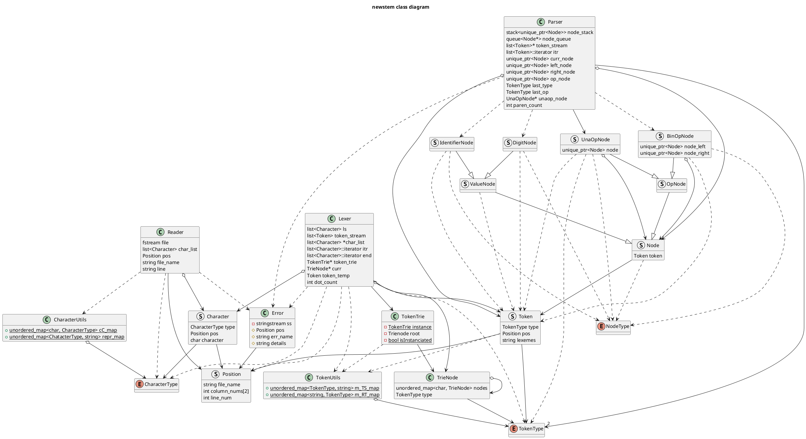

# Stem Class Diagram

```plantuml
@startuml stem class diagram
'https://plantuml.com/class-diagram
title newstem class diagram

hide methods

struct Position {
string file_name
int column_nums[2]
int line_num
void init()
}
enum CharacterType
class CharacterUtils {
+{static} unordered_map<char, CharacterType> cC_map
+{static} unordered_map<ChatacterType, string> repr_map
}
CharacterUtils o--> CharacterType
struct Character {
CharacterType type
Position pos
char character
}
Character --> CharacterType
Character --> Position
class Reader {
fstream file
list<Character> char_list
Position pos
string file_name
string line
}
Reader o--> Character
Reader --> Position
Reader ..> CharacterUtils
Reader ..> Error
Reader ..> CharacterType
enum TokenType
struct Token {
TokenType type
Position pos
string lexemes
}
Token --> TokenType
Token --> Position
Token ..> TokenUtils
class TokenUtils {
+{static} unordered_map<TokenType, string> m_TS_map
+{static} unordered_map<string, TokenType> m_RT_map
}
TokenUtils o--> TokenType
class Error {
-stringstream ss
#Position pos
#string err_name
#string details
}
Error --> Position
class TrieNode {
unordered_map<char, TrieNode> nodes
TokenType type
}
TrieNode o--> TrieNode
TrieNode --> TokenType
class TokenTrie {
-{static} TokenTrie instance
-Trienode root
-{static} bool isInstanciated
}
TokenTrie --> TrieNode
TokenTrie ..> TokenUtils
class Lexer {
list<Character> ls
list<Token> token_stream
list<Character> *char_list
list<Character>::iterator itr
list<Character>::iterator end
TokenTrie* token_trie
TrieNode* curr
Token token_temp
int dot_count
}
Lexer ..> Error
Lexer o--> Token
Lexer o--> Character
Lexer ..> CharacterType
Lexer ..> Position
Lexer ..> TokenType
Lexer ..> TokenUtils
Lexer --> TrieNode
Lexer --> TokenTrie
enum NodeType
struct Node {
Token token
}
Node --> Token
Node ..> NodeType
struct ValueNode
ValueNode --|> Node
ValueNode ..> Token
struct IdentifierNode
IdentifierNode --|> ValueNode
IdentifierNode ..> Token
IdentifierNode ..> NodeType
struct DigitNode
DigitNode --|> ValueNode
DigitNode ..> Token
DigitNode ..> NodeType
struct OpNode
OpNode --|> Node
struct BinOpNode {
unique_ptr<Node> node_left
unique_ptr<Node> node_right
}
BinOpNode --|> OpNode
BinOpNode o--> Node
BinOpNode ..> NodeType
BinOpNode ..> Token
struct UnaOpNode {
unique_ptr<Node> node
}
UnaOpNode --|> OpNode
UnaOpNode o--> Node
UnaOpNode ..> NodeType
UnaOpNode ..> Token
UnaOpNode ..> TokenType
class Parser {
stack<unique_ptr<Node>> node_stack
queue<Node*> node_queue
list<Token>* token_stream
list<Token>::iterator itr
unique_ptr<Node> curr_node
unique_ptr<Node> left_node
unique_ptr<Node> right_node
unique_ptr<Node> op_node
TokenType last_type
TokenType last_op
UnaOpNode* unaop_node
int paren_count
}
Parser o--> Node
Parser o--> Token
Parser --> "2" TokenType
Parser --> UnaOpNode
Parser ..> Error
Parser ..> BinOpNode
Parser ..> DigitNode
Parser ..> IdentifierNode

```
