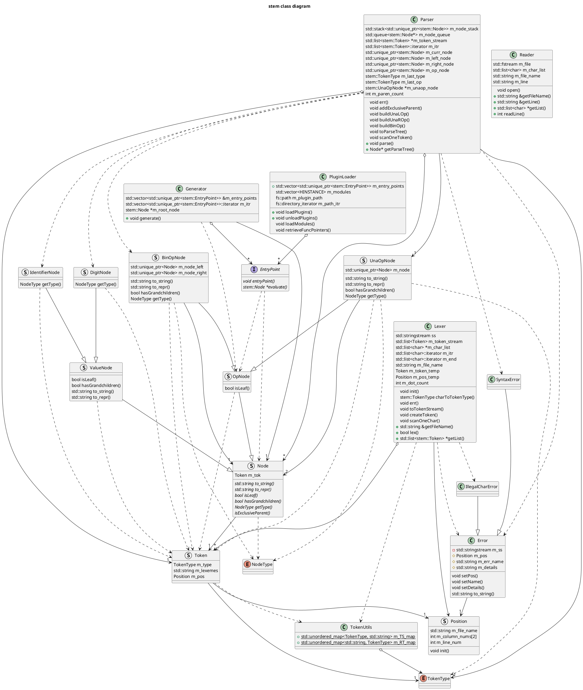
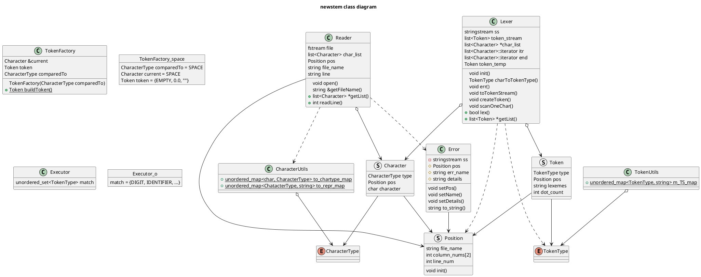

# Stem Class Diagram

```plantuml
@startuml stem class diagram
'https://plantuml.com/class-diagram
title stem class diagram

struct Position {
  std::string m_file_name
  int m_column_nums[2]
  int m_line_num
  void init()
}
struct Token {
  TokenType m_type
  std::string m_lexemes
  Position m_pos
}
enum TokenType
class TokenUtils {
  +{static} std::unordered_map<TokenType, std::string> m_TS_map
  +{static} std::unordered_map<std::string, TokenType> m_RT_map
}
class Error {
  -std::stringstream m_ss
  #Position m_pos
  #std::string m_err_name
  #std::string m_details
  void setPos()
  void setName()
  void setDetails()
  std::string to_string()
}
class IllegalCharError
class SyntaxError
enum NodeType
struct Node {
  Token m_tok
  {abstract} std::string to_string()
  {abstract} std::string to_repr()
  {abstract} bool isLeaf()
  {abstract} bool hasGrandchildren()
  {abstract} NodeType getType()
  {abstract} isExclusiveParent()
}
struct ValueNode {
  bool isLeaf()
  bool hasGrandchildren()
  std::string to_string()
  std::string to_repr()
}
struct IdentifierNode {
  NodeType getType()
}
struct DigitNode {
  NodeType getType()
}
struct OpNode {
  bool isLeaf()
}
struct UnaOpNode {
  std::unique_ptr<Node> m_node
  std::string to_string()
  std::string to_repr()
  bool hasGrandchildren()
  NodeType getType()
}
struct BinOpNode {
  std::unique_ptr<Node> m_node_left
  std::unique_ptr<Node> m_node_right
  std::string to_string()
  std::string to_repr()
  bool hasGrandchildren()
  NodeType getType()
}
interface EntryPoint {
  {abstract} void entryPoint()
  {abstract} stem::Node *evaluate()
}
class PluginLoader {
  +std::vector<std::unique_ptr<stem::EntryPoint>> m_entry_points
  +void loadPlugins()
  +void unloadPlugins()
  std::vector<HINSTANCE> m_modules
  fs::path m_plugin_path
  fs::directory_iterator m_path_itr
  void loadModules()
  void retrieveFuncPointers()
}
class Reader {
  std::fstream m_file
  std::list<char> m_char_list
  std::string m_file_name
  std::string m_line
  void open()
  +std::string &getFileName()
  +std::string &getLine()
  +std::list<char> *getList()
  +int readLine()
}
class Lexer {
  std::stringstream ss
  std::list<Token> m_token_stream
  std::list<char> *m_char_list
  std::list<char>::iterator m_itr
  std::list<char>::iterator m_end
  std::string m_file_name
  Token m_token_temp
  Position m_pos_temp
  int m_dot_count
  void init()
  stem::TokenType charToTokenType()
  void err()
  void toTokenStream()
  void createToken()
  void scanOneChar()
  +std::string &getFileName()
  +bool lex()
  +std::list<stem::Token> *getList()
}
class Parser {
  std::stack<std::unique_ptr<stem::Node>> m_node_stack
  std::queue<stem::Node*> m_node_queue
  std::list<stem::Token> *m_token_stream
  std::list<stem::Token>::iterator m_itr
  std::unique_ptr<stem::Node> m_curr_node
  std::unique_ptr<stem::Node> m_left_node
  std::unique_ptr<stem::Node> m_right_node
  std::unique_ptr<stem::Node> m_op_node
  stem::TokenType m_last_type
  stem::TokenType m_last_op
  stem::UnaOpNode *m_unaop_node
  int m_paren_count
  void err()
  void addExclusiveParent()
  void buildUnaLOp()
  void buildUnaROp()
  void buildBinOp()
  void toParseTree()
  void scanOneToken()
  +void parse()
  +Node* getParseTree()
}
Parser o---> "*" Node
Parser o---> "1" Token
Parser ---> "2" TokenType
Parser ---> "1" UnaOpNode
Parser ...> Error
Parser ...> SyntaxError
Parser ...> BinOpNode
Parser ...> DigitNode
Parser ...> IdentifierNode
class Generator {
  +void generate()
  std::vector<std::unique_ptr<stem::EntryPoint>> &m_entry_points
  std::vector<std::unique_ptr<stem::EntryPoint>>::iterator m_itr
  stem::Node *m_root_node
}
Generator o--> "*" EntryPoint
Generator --> "1" Node
Generator ..> OpNode

Token --> "1" Position
Token --> "1" TokenType
TokenUtils o--> TokenType
Token ..> TokenUtils
Error --> "1" Position
IllegalCharError --|> Error
SyntaxError --|> Error
Node --> "1" Token
Node ..> NodeType
ValueNode --|> Node
ValueNode ..> Token
IdentifierNode --|> ValueNode
IdentifierNode ..> Token
DigitNode --|> ValueNode
DigitNode ..> Token
OpNode --|> Node
OpNode ..> Token
UnaOpNode --|> OpNode
UnaOpNode --> "2" Node 
UnaOpNode ..> Token
UnaOpNode ..> TokenType
UnaOpNode ..> NodeType
BinOpNode --|> OpNode
BinOpNode --> "1" Node
BinOpNode ..> Token
BinOpNode ..> NodeType
EntryPoint ..> Node
EntryPoint ..> OpNode
PluginLoader o--> "*" EntryPoint
Lexer o--> "*" Token
Lexer --> Position
Lexer ..> Error
Lexer ..> IllegalCharError
Lexer ..> TokenUtils

```

```plantuml
@startuml newstem class diagram
'https://plantuml.com/class-diagram
title newstem class diagram

struct Position {
string file_name
int column_nums[2]
int line_num
void init()
}
enum CharacterType
class CharacterUtils {
+{static} unordered_map<char, CharacterType> to_chartype_map
+{static} unordered_map<ChatacterType, string> to_repr_map
}
CharacterUtils o--> CharacterType
struct Character {
CharacterType type
Position pos
char character
}
Character --> CharacterType
Character --> Position
class Reader {
fstream file
list<Character> char_list
Position pos
string file_name
string line
void open()
string &getFileName()
+list<Character> *getList()
+int readLine()
}
Reader o--> Character
Reader --> Position
Reader ..> CharacterUtils
Reader ..> Error
enum TokenType
struct Token {
TokenType type
Position pos
string lexemes
int dot_count
}
Token --> TokenType
Token --> Position
class TokenUtils {
+{static} unordered_map<TokenType, string> m_TS_map
}
TokenUtils o--> TokenType
class Error {
-stringstream ss
#Position pos
#string err_name
#string details
void setPos()
void setName()
void setDetails()
string to_string()
}
Error --> Position
class Lexer {
stringstream ss
list<Token> token_stream
list<Character> *char_list
list<Character>::iterator itr
list<Character>::iterator end
Token token_temp
void init()
TokenType charToTokenType()
void err()
void toTokenStream()
void createToken()
void scanOneChar()
+bool lex()
+list<Token> *getList()
}
Lexer o--> Token
Lexer o--> Character
Lexer ..> Position
Lexer ..> TokenType
class TokenFactory {
Character &current
Token token
CharacterType comparedTo
TokenFactory(CharacterType comparedTo)
+{static}Token buildToken()
}
object TokenFactory_space {
CharacterType comparedTo = SPACE
Character current = SPACE
Token token = {EMPTY, 0.0, ""}
}
class Executor {
unordered_set<TokenType> match
}
object Executor_o {
match = {DIGIT, IDENTIFIER, ...}
}

```
